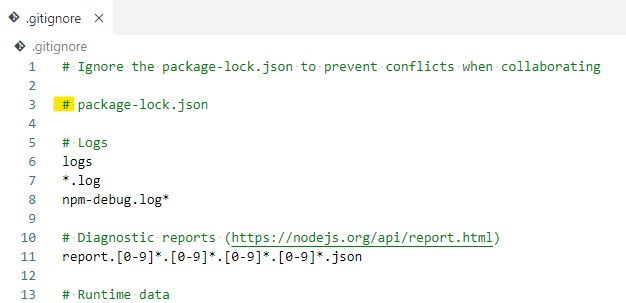
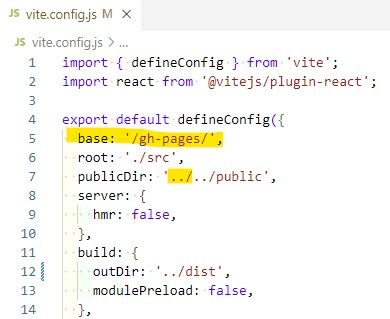
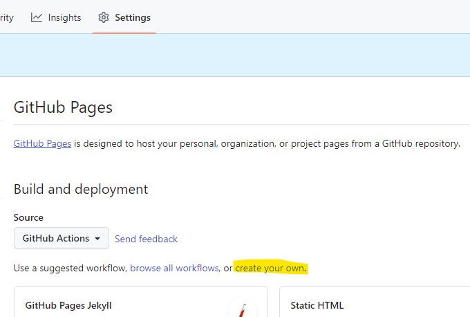
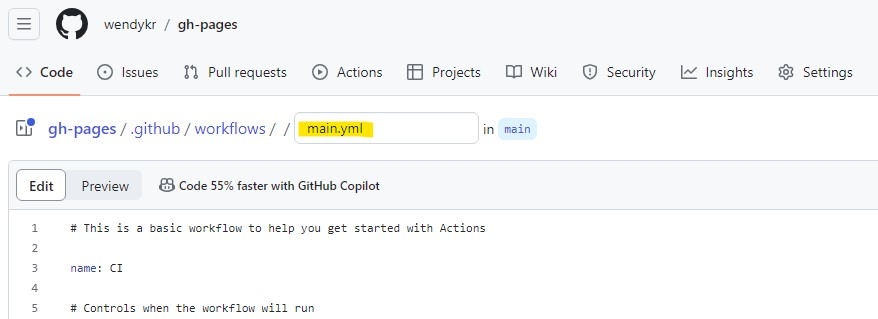
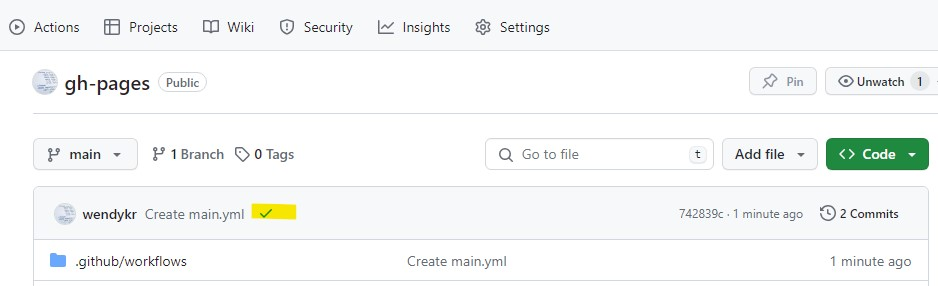
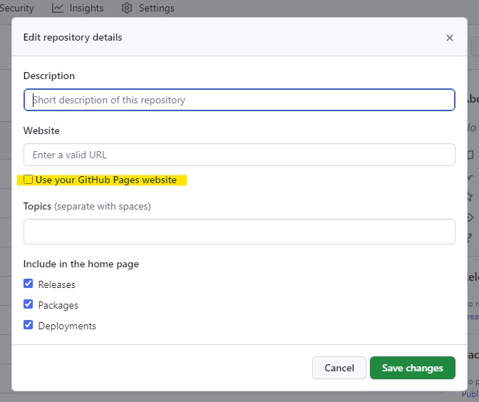

# Deploy Vite project jako GitHub Pages 

Návod je pro nás účastníky Czechitas kurzů **React** nebo **Digitální akademie: Web**, abychom si mohli své projekty založené pomocí příkazu

`npm init kodim-app@latest nazev-projektu react`

publikovat na GitHub Pages bez nutnosti hledat poskytovatele webhostingů.

Níže uvedený postup je užitečný za předpokladu, že dokážeme u sebe na localhostu projekt sestavit pomocí příkazu `npm run build` a následně jej publikovat na svůj GitHub účet.


## Před push do repozitáře na svém GH účtu
1. V souboru `.gitignote` zakomentujeme pomocí znaku `#` řádek č. 3, na kterém se nachází `package-lock.json`

    

2. V souboru `vite.config.js` před řádek č. 5 (`root: './src'`) přidáme řádek `base: '/name-repository/'` a názvem svého repozitáře, na kterém chceme deploy GitHub Pages, v mém případě

    `gh-pages base: '/gh-pages/'.`

3. Stále v souboru `vite.config.js` přidáme cestu o adresář výš `../` u `publicDir`:

    `publicDir: '../../public',`
    
    

Soubory `.gitignote` a `vite.config.js` nezapomeneme uložit.


## Po úspěšném pushnutí svého repozitáře na GH
1. V nastavení svého repozitáře přes menu **Settings** > **Pages** > u **Source Deploy from a branch** vybereme *GitHubActions*

    

2. Pod tím klikneme na `create your own`, kde na stránce pojmenujeme libovolným názvem soubor, ale musí být s příponou `.yml`, v mém případě
    `main.yml`

    

3. Vymažeme jeho obsah a vložíme níže uvedený kód, který je převzatý z oficiálních stránek [Vite](https://vitejs.dev/guide/static-deploy).

    ```
    # Simple workflow for deploying static content to GitHub Pages
    name: Deploy static content to Pages
    
    on:
      # Runs on pushes targeting the default branch
      push:
        branches: ['main']
    
      # Allows you to run this workflow manually from the Actions tab
      workflow_dispatch:
    
    # Sets the GITHUB_TOKEN permissions to allow deployment to GitHub Pages
    permissions:
      contents: read
      pages: write
      id-token: write
    
    # Allow one concurrent deployment
    concurrency:
      group: 'pages'
      cancel-in-progress: true
    
    jobs:
      # Single deploy job since we're just deploying
      deploy:
        environment:
          name: github-pages
          url: ${{ steps.deployment.outputs.page_url }}
        runs-on: ubuntu-latest
        steps:
          - name: Checkout
            uses: actions/checkout@v4
          - name: Set up Node
            uses: actions/setup-node@v3
            with:
              node-version: 18
              cache: 'npm'
          - name: Install dependencies
            run: npm install
          - name: Build
            run: npm run build
          - name: Setup Pages
            uses: actions/configure-pages@v3
          - name: Upload artifact
            uses: actions/upload-pages-artifact@v2
            with:
              # Upload dist repository
              path: './dist'
          - name: Deploy to GitHub Pages
            id: deployment
            uses: actions/deploy-pages@v2
    ```

    a změny commitneme.

    V hlavním adresáři budeme mít tuto cestu k souboru `.github/workflows/main.yml`

5. vrátíme se zpět do svého repozitáře a pokud byly naše stránky úspěšně deploynuty, zobrazí se nám zelená ✔.

    

6. jako poslední krok u About přes kliknutí na ikonu nastavení zatrhneme "Use your GitHub Pages website" a změny uložíme.

    

Nyní se můžeme těšit ze svého projektu, který jsme dokázaly publikovat přes GitHub Pages 🥳.


[https://wendykr.github.io/gh-pages/](https://wendykr.github.io/gh-pages/)